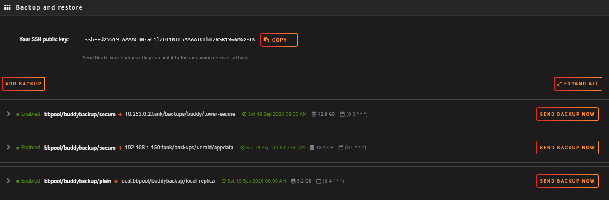
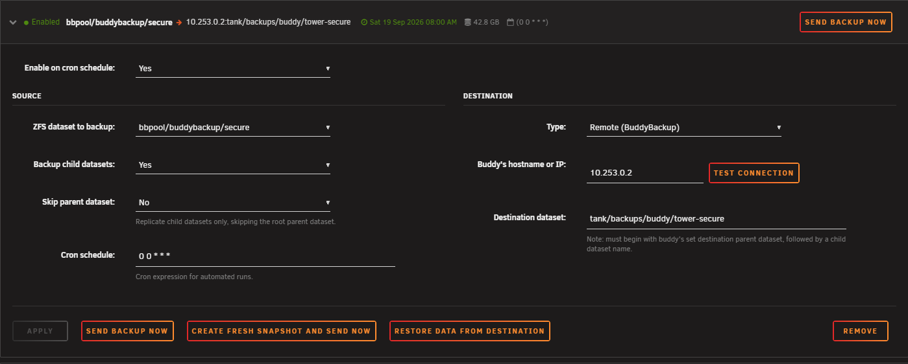
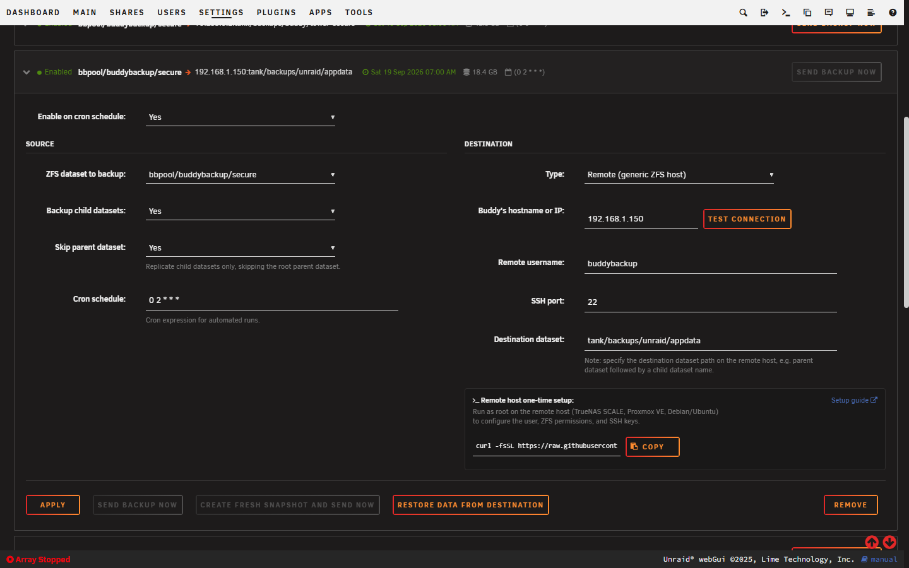
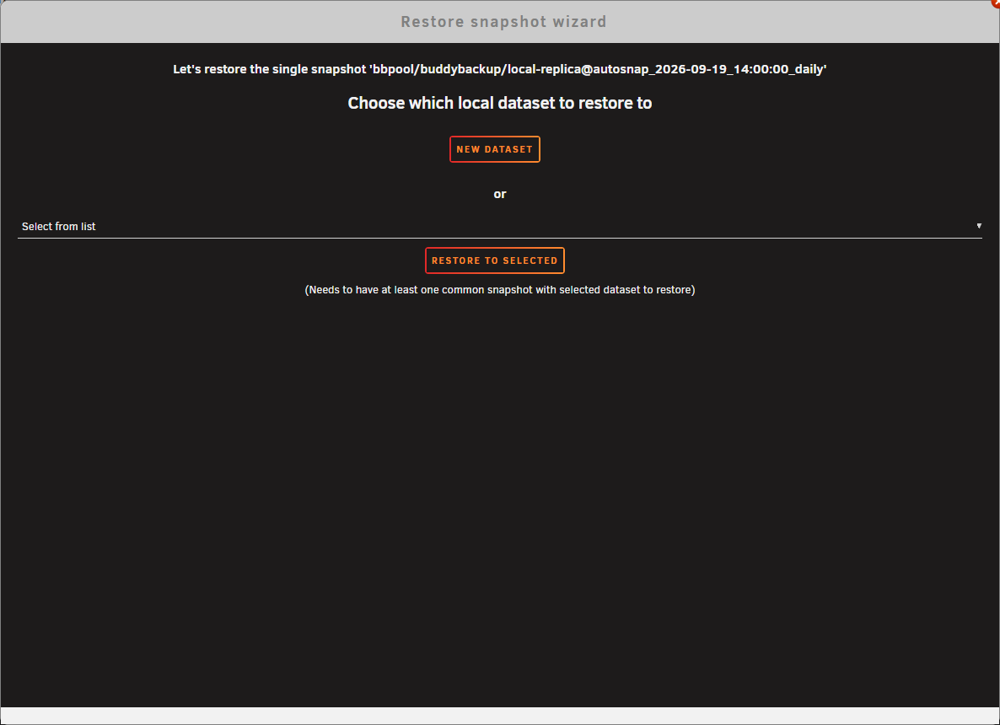
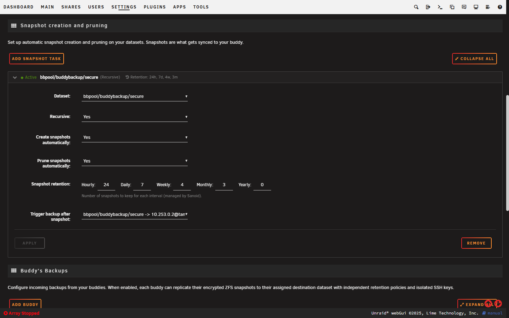
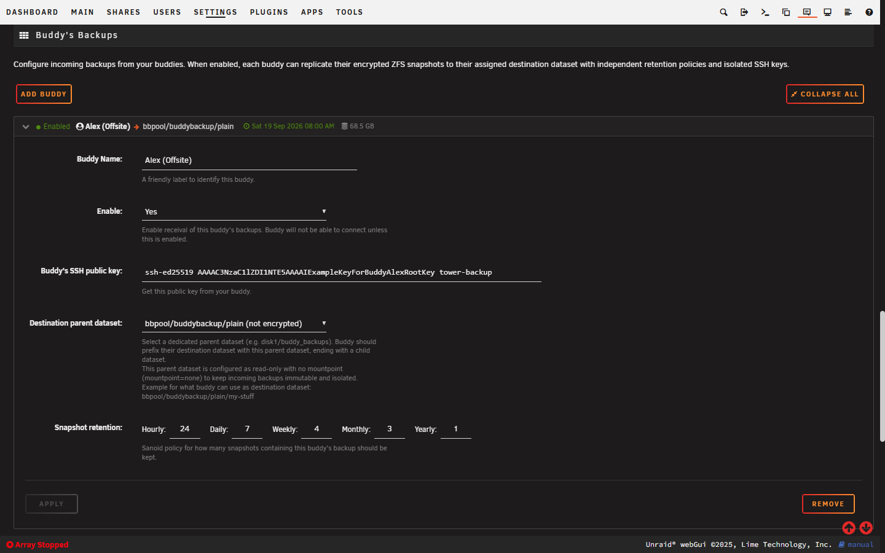
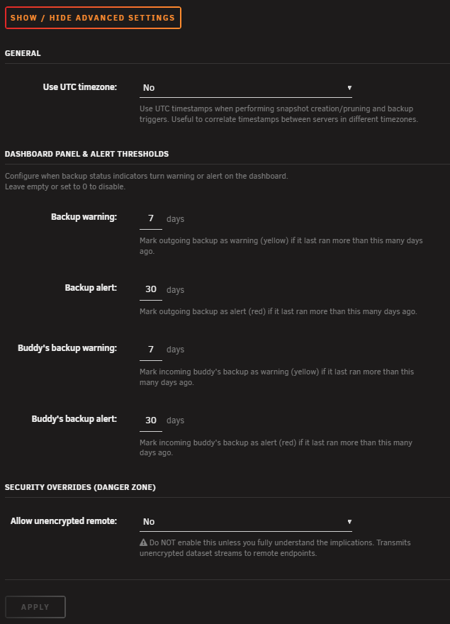
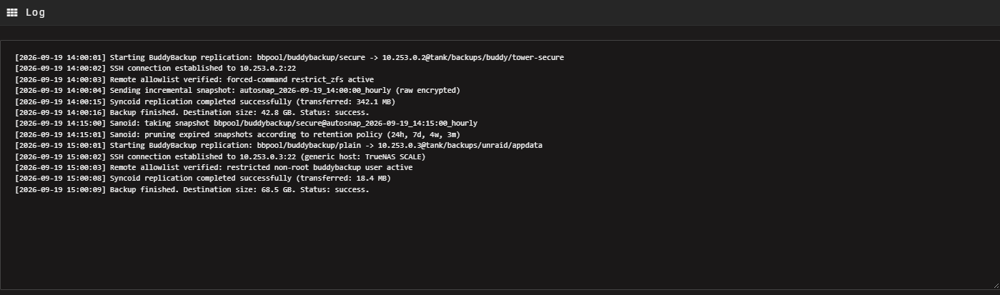
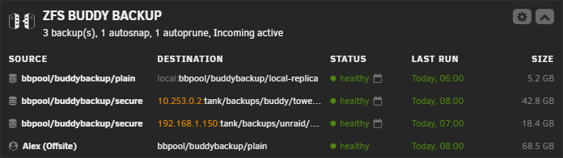

# ZFS BuddyBackup — Comprehensive Plugin & User Guide

> **Official Forum Guide Thread**: [Unraid Community Forums - ZFS BuddyBackup Plugin Guide](https://forums.unraid.net/topic/186256-zfs-buddybackup-plugin-guide/)  
> **Source Code**: [GitHub - Piratkopia13/unraid-buddybackup](https://github.com/Piratkopia13/unraid-buddybackup)  
> **Compatibility**: Unraid 6.12.0 or newer with ZFS  

---

## Overview

**ZFS BuddyBackup** is an Unraid plugin designed to make ZFS snapshot maintenance, local pool replication, and offsite backups between two Unraid servers (or between Unraid and any generic OpenZFS system) simple, automated, and secure.

Whether you are backing up to a trusted buddy running Unraid, pushing backups to an offsite TrueNAS SCALE / Proxmox VE system, or replicating locally between pools, BuddyBackup ensures:
- **Raw Encrypted Transfers**: Remote transfers use raw ZFS send (`zfs send -w`). Data remains encrypted in transit and at rest on the remote server without requiring the destination host to possess your encryption keys (zero-knowledge backup destination).
- **Least-Privilege Security**: Remote connections run as a restricted non-root `buddybackup` user locked to an SSH forced-command allowlist (`restrict_zfs`). No interactive shell access or arbitrary command execution is permitted.
- **Remote Immutability**: Destructive commands (such as `zfs destroy` and `zfs rollback`) are strictly blocked on the receiver. Even if a sender system is compromised, existing snapshots on the receiver cannot be deleted remotely.

> [!CAUTION]
> **Disclaimer**: I take no responsibility for data loss or damage caused by using this plugin. Please review the open-source code and report any bugs or suggestions on GitHub or the Unraid forum.

---

## Prerequisites & Installation

1. **Unraid Version**: Unraid 6.12.0 or newer with OpenZFS.
2. **Installation**: Install **ZFS BuddyBackup** directly via the Unraid **Community Applications (Apps)** tab.
3. **Encryption**: By default, remote backups require an encrypted source ZFS dataset. If you must back up unencrypted datasets remotely over a trusted private network, you can explicitly enable this under **Advanced Settings**.
4. **Network Connection**: For remote backups, connect over a secure network such as a VPN (Tailscale, WireGuard) or direct private network. Avoid exposing SSH directly to the public internet.

---

## Interface Walkthrough

In the Unraid WebGUI, access the plugin under **Tools → ZFS Buddy Backup** (or click the settings cog icon on the BuddyBackup **Dashboard** widget).

The interface is organized into five dedicated tabs:
1. [Backup and restore](#1-backup-and-restore)
2. [Snapshot creation and pruning](#2-snapshot-creation-and-pruning)
3. [Buddy's Backups](#3-buddys-backups-receiving-backups)
4. [Advanced Settings](#4-advanced-settings)
5. [Log](#5-log)

*(A live status panel is also available on the main Unraid [Dashboard](#6-unraid-dashboard-integration)).*

---

### 1. Backup and restore

This is your main command center for creating, scheduling, monitoring, and restoring backups.



#### Your SSH Public Key Banner
At the top of the page, your sender SSH public key is displayed:
- Click the **Copy** button (or click the field to select all) to copy your public key.
- Send this key to your buddy so they can add it to their **Buddy's Backups** page (or use it when running the one-time setup on a generic receiver).

#### Section Toolbar
- **Add Backup**: Adds a new backup task card to the list.
- **Expand All / Collapse All**: Expands or collapses all configured backup task cards at once.

#### Backup Task Cards
Each backup task is contained within an individual collapsible card. The header summarizes:
- **Expand/Collapse Chevron**: Click anywhere on the header to toggle the card open or closed.
- **Status Indicator**:
  - `Enabled` / `Healthy` (green dot): Active and running normally.
  - `Triggered by snapshot` / `Enabled + Triggered` (green dot): Configured to execute automatically when triggered by snapshot creation.
  - `Warning` (yellow dot): Overdue — the backup has not successfully run within the configured warning threshold (default: >7 days).
  - `Alert` / `Critical` (red dot): Severely overdue — the backup has not run within the critical threshold (default: >30 days).
  - `Failed` (red dot): The last backup run encountered an error.
  - `Disabled` (grey dot): Automated execution is disabled and no snapshot triggers are assigned.
  - `New Task` (orange dot): An unsaved task card.
- **Route Summary**: Source dataset `pool/dataset` → Destination `host:target` or `local:target`.
- **Telemetry Indicators**: Displays the timestamp of the last successful run (e.g. `Sat 19 Sep 2026 08:00 AM`), destination size (e.g. `42.8 GB`), cron schedule badge (e.g. `(0 0 * * *)`), and snapshot trigger badge (`Snapshot trigger`).
- **Quick Action**: A **Send backup now** button right on the header allows triggering replication instantly without needing to expand the card.

#### In-Card Alert Banners
When a task requires attention, a dedicated alert banner appears at the top of the expanded card:
- **Last backup failed** (red banner): Displays the failure date, the exact error message reported by the replication process, and a **View Log** button jumping directly to `/var/log/buddybackup.log`.
- **Backup Warning / Alert (Overdue)** (yellow/red banner): Displays the number of days the backup is overdue and the date of the last successful run, with a direct **View Log** shortcut.

Clicking the card header expands the configuration form:



#### Source Settings (Left Column)
- **Enable on cron schedule**: Toggle automated execution (`Yes` / `No`).
- **ZFS dataset to backup**: Select the local dataset to replicate. By default, only encrypted datasets are selectable for remote tasks; all datasets become available when destination is Local or if unencrypted remote transfers are enabled in Advanced Settings.
- **Backup child datasets**: Set to `Yes` to recursively include all child datasets and snapshots.
- **Skip parent dataset**: Visible when *Backup child datasets* is `Yes`. Set to `Yes` to replicate only child datasets while skipping the root parent dataset (useful when backing up pool root containers without duplicating the parent root).
- **Cron schedule**: Standard 5-field cron expression defining automated execution (default placeholder: `0 0 * * *` for midnight).

#### Destination Settings (Right Column)
Select one of three destination types:

1. **Remote (BuddyBackup)** (Unraid → Unraid):
   - **Buddy's hostname or IP**: Your buddy's VPN IP or hostname.
   - **Test connection**: Tests SSH connectivity, verifies ZFS probe responses, and confirms that the remote user is locked to `restrict_zfs`.
   - **Destination dataset**: The target dataset on your buddy's server. Must begin with your buddy's configured destination parent dataset, followed by a child dataset name (e.g. `tank/backups/buddy/my-server-data`).

2. **Remote (generic ZFS host)** (Unraid → TrueNAS SCALE / Proxmox VE / Linux):
   - **Buddy's hostname or IP**: Remote host IP or hostname.
   - **Remote username**: Restricted user on the remote host (default: `buddybackup`).
   - **SSH port**: SSH service port on the remote host (default: `22`).
   - **Destination dataset**: Target dataset path on the remote host (e.g. `tank/backups/unraid/appdata`).
   - **Remote host one-time setup**: A dynamic command generator. It automatically formats the one-time root command containing your exact username, port, parent dataset, and Unraid public key. Click **Copy** to copy the command and run it once on the remote machine.
   - **Test connection**: Comprehensive validation: verifies SSH connectivity, remote ZFS version, dataset existence, `feature@encryption` support, resume token capability (`feature@extensible_dataset`), delegated permissions (`create`, `mount`, `receive`, and raw `send`), and command isolation (`restrict_zfs`).



3. **Local** (Pool-to-Pool on the same Unraid server):
   - **Destination dataset**: The local dataset to receive the backup (autocomplete datalist provided).
   - **Duplicate Dataset Warning**: If you configure a new local backup targeting a dataset that already exists, the plugin prompts with a confirmation dialog before proceeding.
   - **Write Protection**: Local destination datasets are automatically set to `readonly=on` upon successful synchronization. This protects your backups against accidental edits, deletion, and ransomware, while keeping files browsable in read-only mode across network shares.

#### Card Action Buttons
- **Dynamic Lock on Unsaved Changes**: Modifying any field in an expanded card unlocks the **Apply** button and temporarily locks execution buttons (*"Apply changes to enable this"*) to prevent desynchronized execution.
- **Apply**: Saves and registers the backup task configuration and cron schedule.
- **Send backup now**: Executes replication in the background. First runs preflight checks verifying source dataset existence, encryption, and snapshot availability. If no snapshots exist yet, a modal prompts you to create a fresh snapshot and send immediately.
- **Create fresh snapshot and send now**: Creates a brand-new local snapshot (named `autosnap_YYYY-MM-DD_HH:MM:SS_hourly` or incremented) and immediately replicates it to the destination.
- **Restore data from destination**: Launches the interactive **Restore Snapshot Wizard**.
- **Remove**: Prompts for confirmation and deletes the backup task.

#### Restore Snapshot Wizard
Clicking **Restore data from destination** opens an interactive restoration modal:



1. **Snapshot Selection**: Queries the destination host for available snapshots grouped by dataset.
2. **Restoration Mode**:
   - **Restore selected snapshot**: Restores the single snapshot selected in the list.
   - **Restore all snapshots in selected dataset**: Restores the complete snapshot history for that dataset.
3. **Destination Selection**:
   - **New dataset**: Enter a name to create a brand-new local dataset.
   - **Restore to selected**: Select an existing local dataset from the dropdown (requires at least one common snapshot with the backup).
4. **Live Progress Console**: Streams real-time restoration progress with an **Abort** button. Restores continue in the background if the window is closed, and an Unraid notification is issued upon completion.

---

### 2. Snapshot creation and pruning

BuddyBackup includes built-in automated snapshot creation and pruning powered by **Sanoid**. If you don't already use another snapshot manager, configure your policies here.



#### Section Toolbar
- **Add Snapshot Task**: Adds a new dataset snapshot policy card.
- **Expand All / Collapse All**: Toggles expansion of all snapshot cards.

#### Task Card Header
Summarizes status (`Active` / `Inactive` / `New Task`), dataset name (with `(Recursive)` indicator if enabled), retention summary badge (e.g. `Retention: 24h, 7d, 4w, 3m`), and trigger badge (e.g. `Triggers: pool/data -> host:dataset`).

#### Configuration Options
- **Dataset**: Select the local ZFS dataset to snapshot.
- **Recursive**: Apply the snapshot policy recursively to all child datasets (`No` / `Yes`).
- **Create snapshots automatically**: Automatically generate snapshots on schedule (`No` / `Yes`).
- **Prune snapshots automatically**: Automatically prune older snapshots according to the retention schedule (`No` / `Yes`).
- **Snapshot retention**: Number of snapshots to keep across intervals (managed by Sanoid):
  - Hourly (e.g. keep `24`)
  - Daily (e.g. keep `7`)
  - Weekly (e.g. keep `4`)
  - Monthly (e.g. keep `3`)
  - Yearly (e.g. keep `0`)
- **Trigger backup after snapshot**: Seamlessly links snapshot creation to offsite backups! Select any configured backup task. When Sanoid creates a new snapshot of this dataset, it automatically triggers that backup task to replicate immediately.

> [!NOTE]
> Sanoid runs automatically every 15 minutes (`*/15 * * * *`) via Unraid's system cron whenever at least one snapshot task or incoming buddy is enabled. Snapshot creation and pruning operate in UTC if **Use UTC timezone** is enabled in Advanced Settings.

---

### 3. Buddy's Backups (Receiving Backups)

This tab configures your Unraid server to receive incoming backups from your buddies (or from remote TrueNAS/Proxmox servers).



#### Multi-Buddy Management
You can configure multiple independent buddy entries. Each buddy receives an isolated configuration with their own public key, target dataset, and retention policy:
- **Add Buddy**: Creates a new buddy receiver entry.
- **Expand All / Collapse All**: Toggles expansion of all buddy cards.

#### Card Header & Overdue Alert Banners
The card header displays the buddy's name, destination dataset route, date of the last received backup, and the current storage consumed. If no backup has been received within the configured alert thresholds, a Warning or Critical alert banner appears inside the card with a **View Log** shortcut.

#### Configuration Options
- **Buddy Name**: A friendly label to identify this buddy (e.g. `Alex (Offsite)`, `Bob (TrueNAS)`).
- **Enable**: Set to `Yes` to allow incoming backup connections for this buddy.
- **Buddy's SSH public key**: Paste your buddy's public SSH key. BuddyBackup restricts this key in `/home/buddybackup/.ssh/authorized_keys` to the forced command allowlist (`restrict_zfs --dataset '<dataset>' --uid '<uid>'`).
- **Destination parent dataset**: Select the parent dataset on your server where your buddy's backups will live (e.g. `disk1/buddy_backups`).
  - *Dedicated sub-dataset required*: Always choose a dedicated sub-dataset (must contain a `/`), never a bare root pool or disk (`disk1`).
  - *Dataset Overlap Prevention*: BuddyBackup validates and strictly forbids overlapping datasets across different buddies (e.g. buddy A cannot use `disk1/backups` if buddy B uses `disk1/backups/sub` or the same path).
  - *Immutability & Isolation*: BuddyBackup automatically applies `readonly=on`, `mountpoint=none`, `setuid=off`, and `exec=off` to the parent dataset. This keeps incoming backups immutable, isolated from Unraid's VFS tree, and protected against accidental edits or ransomware.
  - *Emergency Failover*: Because `readonly` and `mountpoint` are inherited from the parent dataset, restoring a snapshot via the Restore Wizard automatically creates an active, writable dataset. For an emergency in-place failover directly on the backup dataset, run:
    ```bash
    zfs set readonly=off <pool/dataset>
    zfs inherit mountpoint <pool/dataset>
    ```
- **Snapshot retention**: Your local Sanoid retention policy for your buddy's snapshots (Hourly, Daily, Weekly, Monthly, Yearly). Unraid's local Sanoid service prunes older snapshots according to this policy (`autosnap = no`, `autoprune = yes`).

> [!NOTE]
> **Receiving from TrueNAS SCALE or Proxmox VE?**  
> Sudo mode is not supported when pushing to Unraid (BuddyBackup strictly blocks `sudo` and uses native OpenZFS delegations). In TrueNAS, keep **Use Sudo For ZFS Commands** unchecked; for Syncoid, pass `--no-privilege-elevation`. Because BuddyBackup enforces `mountpoint=none` on the parent dataset, TrueNAS will automatically skip `zfs mount` calls, keeping your Unraid syslog clean. See the [Generic ZFS Hosts Deep-Dive](#generic-zfs-hosts-deep-dive) below for instructions on TrueNAS replication tasks and snapshot naming conventions.

---

### 4. Advanced Settings

Fine-tune global daemon behavior, alert thresholds, and security overrides.



#### Show / Hide Advanced Settings
To prevent unintended modifications to system defaults and thresholds, the advanced settings form is collapsed by default behind the **Show / Hide Advanced Settings** toggle button.

#### General
- **Use UTC timezone** (`No` / `Yes`, default: `No`):  
  Forces UTC timestamps (`TZ=UTC`) for Sanoid automated snapshot creation, pruning cronjobs, and manual snapshot generation (`autosnap_YYYY-MM-DD_HH:MM:SS_hourly`). Useful to correlate timestamps between servers located in different geographical timezones.

#### Dashboard Panel & Alert Thresholds
Configure when backup status indicators turn warning (yellow) or alert (red) on the Unraid Dashboard panel and task card headers. Leave empty or set to `0` to disable a threshold:
- **Backup warning** (days, default: `7`):  
  Marks an outgoing backup as warning (yellow) if it last ran more than this many days ago.
- **Backup alert** (days, default: `30`):  
  Marks an outgoing backup as alert (red) if it last ran more than this many days ago.
- **Buddy's backup warning** (days, default: `7`):  
  Marks an incoming buddy's backup as warning (yellow) if no backup has been received from that buddy in more than this many days.
- **Buddy's backup alert** (days, default: `30`):  
  Marks an incoming buddy's backup as alert (red) if no backup has been received from that buddy in more than this many days.

#### Security Overrides (Danger Zone)
- **Allow unencrypted remote** (`No` / `Yes`, default: `No`):  
  By default, BuddyBackup enforces raw encrypted transfers (`zfs send -w`) for remote backups, requiring the source dataset to have ZFS encryption enabled. Enabling this override permits transmitting unencrypted dataset streams across the network to remote endpoints without encryption.

> [!WARNING]
> Do NOT enable **Allow unencrypted remote** unless you operate over a secure private VPN and fully understand the implications. When enabled, your data is transmitted and stored on the remote host without ZFS native encryption.

---

### 5. Log

Displays the live system log from `/var/log/buddybackup.log`.



- Automatically polls and streams new log entries every 2 seconds as backups, pruning routines, and replication tasks run.
- Supports direct browser anchor linking via `#log` or `#buddybackup-log` (used by the **View Log** buttons on task card alert banners).
- Useful for diagnosing SSH connectivity issues, Syncoid output, preflight errors, or permission delegation checks.

---

### 6. Unraid Dashboard Integration

ZFS BuddyBackup integrates directly into Unraid's main **Dashboard**:



- **Header Summary Line**: Displays a real-time aggregate counter of configured tasks (e.g. `3 backup(s), 1 autosnap, 1 autoprune, Incoming active`).
- **Settings Cog**: Direct shortcut link leading to **Tools → ZFS Buddy Backup**.
- **Accordion Toggle**: Standard Unraid chevron button (`openclose`) to expand or collapse the dashboard tile content.
- **5-Column Responsive Status Grid**:
  - **Source**: Source dataset name with database icon (or buddy name with user icon for incoming backups).
  - **Destination**: Remote endpoint (`host:dataset`) or local target (`local:dataset`).
  - **Status**: Status dot (`healthy`, `warning`, `alert`, `failed`, or `disabled`) accompanied by schedule badges (lightning bolt for snapshot triggers, calendar icon for cron schedules). Hovering displays a detailed tooltip with last run date.
  - **Last run**: Human-readable relative timestamp (e.g. `Today, 06:00`, `Yesterday, 14:00`, day of week, or date).
  - **Size**: Used storage on the destination dataset (e.g. `42.8 GB`).

---

## Generic ZFS Hosts Deep-Dive

BuddyBackup works seamlessly with non-Unraid OpenZFS systems like **TrueNAS SCALE**, **Proxmox VE**, or standard **Debian/Ubuntu** servers.

### Scenario A: Unraid Pushes Backups to Generic Host

#### How It Works
1. In Unraid, go to **Tools → ZFS Buddy Backup → Backup and restore** and add a backup entry with **Type: Remote (generic ZFS host)**.
2. Fill in the remote host IP, remote user (e.g. `buddybackup`), SSH port (default: `22`), and destination dataset (e.g. `tank/backups/unraid/appdata`).
3. In the **Remote host one-time setup** box inside the card, click **Copy** to grab the generated setup command.
4. On the remote host, run the setup command as root:
   ```bash
   curl -fsSL https://raw.githubusercontent.com/Piratkopia13/unraid-buddybackup/refs/heads/main/src/usr/local/emhttp/plugins/buddybackup/deps/generic_host_setup.sh | bash -s -- --dataset 'tank/backups/unraid' --user 'buddybackup' --port '22' --pubkey 'ssh-ed25519 AAAAC3...'
   ```

#### Script Capabilities & Options
The `generic_host_setup.sh` script is idempotent, safe to re-run, and self-verifying:
- `--dataset NAME`: Target parent dataset (repeatable for multiple datasets; created with `mountpoint=none` and `readonly=on` if missing).
- `--user NAME`: Restricted user account (default: `buddybackup`; UID 0/root is strictly refused).
- `--port N`: SSH port (default: `22`).
- `--pubkey KEY`: Unraid's single-line SSH public key.
- `--sudo-mode auto|yes|no`: Controls whether validated commands run via sudo when `zfs` is not executable directly by the user.
- `--allowlist-dir PATH`: Directory for the forced-command script (default: `/usr/local/sbin`; on TrueNAS SCALE, defaults to `/mnt/<pool>/.buddybackup`).
- `--verify`: Runs only the verification checklist without making changes.
- `--revoke NAME`: Revokes ZFS delegations and removes a dataset from the tracked grant set.
- `--clean`: Completely uninstalls all delegations, allowlist files, sudoers entries, and SSH keys.

#### Platform-Specific Notes:
- **Proxmox VE / Debian / Ubuntu**: Run the command directly in a root shell. The script creates the user, applies ZFS delegations (`create,mount,receive` and raw `send`), installs the allowlist script to `/usr/local/sbin/`, writes the SSH forced command line, and adds an SSH drop-in to `/etc/ssh/sshd_config.d/`.
- **TrueNAS SCALE**:
  1. **Persistent Allowlist Location**: TrueNAS SCALE 24.04+ mounts its root filesystem read-only. The setup script automatically places the allowlist in a persistent, root-owned `.buddybackup` directory on the dataset's pool (e.g. `/mnt/<pool>/.buddybackup/`).
  2. **SSH Service**: Ensure SSH is enabled under *System Settings → Services → SSH*.
  3. **Create User**: In *Credentials → Users → Add*, create user `buddybackup`, set shell to `/usr/bin/bash`, disable password login, and paste your Unraid public key into the user's *SSH Public Key* field.
  4. **Run Script**: Open the TrueNAS web shell (`sudo -i`) and run the setup command.
  5. **Sudo Command Grant**: In TrueNAS UI, edit the user under *Credentials → Users* and add `/usr/bin/bash -c *` to *Allowed sudo commands with no password*. (The coarse sudo grant enables execution while the forced-command allowlist script remains the strict security gate).
  6. **SSH Auxiliary Parameters**: Paste the printed `Match User buddybackup` block into *System Settings → Services → SSH → Auxiliary Parameters* and restart SSH.
5. In Unraid, click **Test connection** on the backup entry to verify access.

---

### Scenario B: Generic Host Pushes Backups to Unraid

When a generic host pushes backups to Unraid, your Unraid server acts as the secure receiver.

> [!IMPORTANT]
> **Sudo mode is not supported on Unraid**: Unraid grants dataset permissions via native OpenZFS delegation (`zfs allow`). The `buddybackup` user does not have (or need) sudo privileges, and BuddyBackup's restricted shell strictly blocks any `sudo`-prefixed commands. Ensure remote senders do not attempt privilege elevation.

#### 1. Prepare Unraid (Receiver)
1. In Unraid, go to **Tools → ZFS Buddy Backup → Buddy's Backups**.
2. Click **Add Buddy** (or edit an existing buddy).
3. Set **Enable** to **Yes**.
4. Choose a **Destination parent dataset** (e.g. `disk1/buddy_backups`).
5. Set your desired **Snapshot retention** policy (Hourly, Daily, Weekly, Monthly, Yearly).

#### 2. Configure TrueNAS SCALE (WebGUI Sender)
1. **SSH Connection**:
   - Go to **Credentials → Backup Credentials → SSH Connections → Add**.
   - Set Host to your Unraid IP, Port to `22`, Username to `buddybackup`.
   - Generate a new keypair (or pick an existing one).
   - Copy the public key, paste it into Unraid's **Buddy's Backups → Buddy's SSH public key**, and click **Apply** on Unraid.
2. **Periodic Snapshot Task**:
   - Go to **Data Protection → Periodic Snapshot Tasks → Add**.
   - Select your source dataset and schedule.
   - ⚠️ **Naming Schema**: Change the default naming schema to:
     ```
     autosnap_%Y-%m-%d_%H:%M:%S_daily
     ```
     *(Use `_hourly`, `_daily`, `_weekly`, or `_monthly` matching your schedule. Sanoid on Unraid requires the `autosnap_` prefix and frequency suffix to manage snapshot pruning).*
3. **Replication Task**:
   - Go to **Data Protection → Replication Tasks → Add**.
   - Select your source dataset and snapshot task.
   - Set destination to the Unraid SSH connection and specify the target dataset (e.g. `tank/backups/buddy/truenas-appdata`).
   - ⚠️ **Critical - Use Sudo For ZFS Commands**: Must be **UNCHECKED / DISABLED**!  
     *Unraid grants fine-grained dataset permissions via native OpenZFS delegation (`zfs allow`), and the `buddybackup` user does not have (or need) sudo privileges. BuddyBackup's restricted shell strictly blocks `sudo`.*
   - ⚠️ **Critical - Snapshot Retention Policy**: Set to **"None"**!  
     *Do NOT let TrueNAS manage retention on Unraid. TrueNAS will attempt to execute `zfs destroy` on Unraid, which BuddyBackup strictly rejects to keep your backups immutable. Unraid's local Sanoid service manages retention automatically.*
   - **Read-Only**: Leave set to **"Set"** (default) or **"Ignore"**.

#### 3. Configure Proxmox VE / Debian (CLI Sender)
1. Generate an SSH keypair on the Linux host:
   ```bash
   ssh-keygen -t ed25519 -f /root/.ssh/id_buddybackup -N ""
   ```
2. Copy `/root/.ssh/id_buddybackup.pub` and paste it into Unraid's **Buddy's Backups → Buddy's SSH public key**.
3. Push snapshots using `syncoid`:
   ```bash
   syncoid --no-privilege-elevation --sshkey=/root/.ssh/id_buddybackup pool/dataset buddybackup@<unraid-ip>:tank/backups/buddy/dataset
   ```
   - ⚠️ **Critical - No Sudo / Privilege Elevation**: Always include `--no-privilege-elevation`. Sudo mode is not supported on Unraid, and BuddyBackup's restricted shell will reject any command prefixed with `sudo`.
4. Schedule the command via cron or systemd timer. Older snapshots named with `autosnap_*` will be automatically pruned on Unraid according to your configured retention policy.
